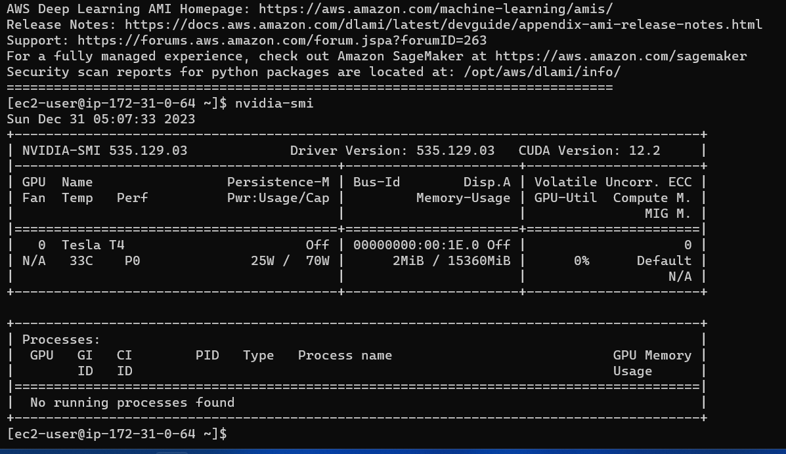
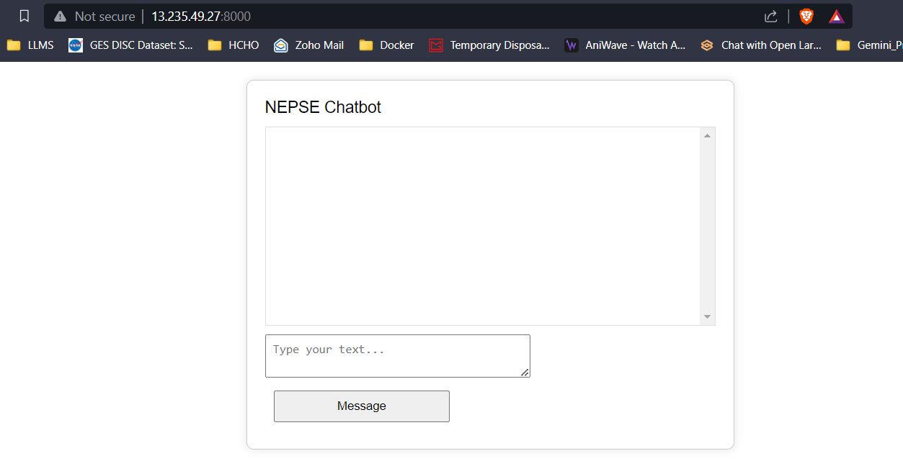
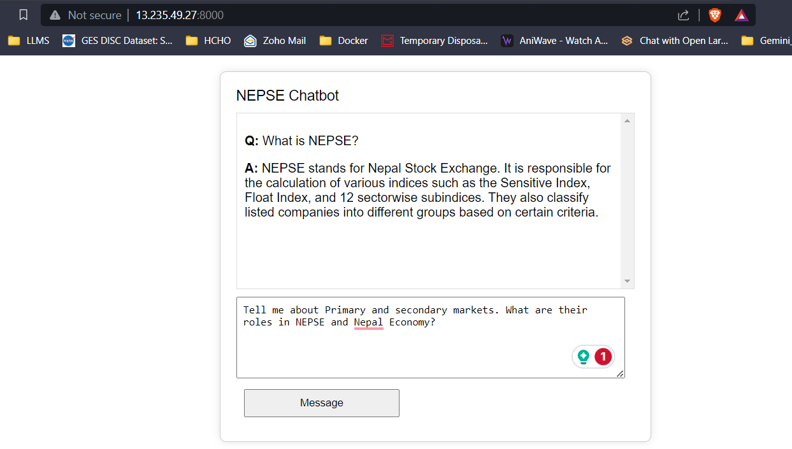
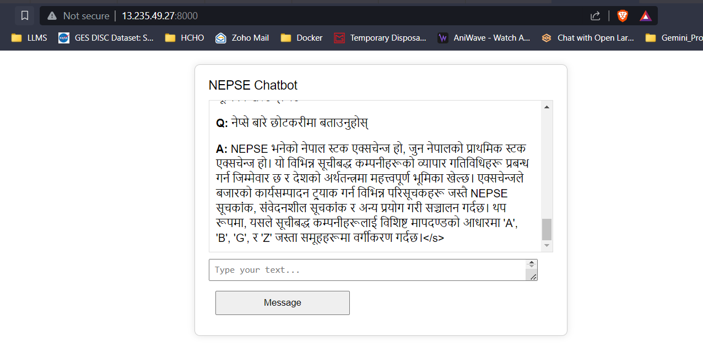

# Retrieval Augmented Generation with Reranking

  

*Image Source: M K Pavan Kumar*

## Reranking Retrievals

  

*Image Source: Pinecone*

This project leverages open-source models to build a chatbot for NEPSE, the Nepal Stock Exchange Ltd, using the Retrieval Augmented Generation technique. The NEPSE booklet PDF is utilized for question-answering. The project utilizes the following open-source models:

1. **Intel/neural-chat-7b-v3-1:** This open-source LLM, originally developed by Intel and quantized by TheBloke, is used. Specifically, the 8-bit GPTQ quantized version is employed due to limited memory.
   - [Original Model](https://huggingface.co/Intel/neural-chat-7b-v3-1)
   - [Quantized Model](https://huggingface.co/TheBloke/neural-chat-7B-v3-1-GPTQ)

2. **all-mpnet-base-v2:** An open-source sentence transformer from Hugging Face called all-mpnet-base-v2 is used to generate high-quality embeddings.
   - [Sentence Transformer](https://huggingface.co/sentence-transformers/all-mpnet-base-v2)

3. **AAI/bge-reranker-large:** An open-source reranking model from Hugging Face called bge-reranker-large is used to re-rank the retrieved documents from the vector store.
   - [Reranking](https://huggingface.co/BAAI/bge-reranker-large)

4. **Google Translate API:** The free Google Translate API is utilized to perform translation between Nepali and English content.

The text data from the NEPSE booklet is cleaned, divided into chunks using langchain, and embeddings are developed using sentence transformers, which are added to the FAISS vector database. When the user asks for input, the embeddings from the input are developed, and the question embeddings are utilized to perform a vector search to retrieve top k documents. The top-k retrieved documents are passed to the reranking model to increase the quality and relevancy of the retrievals. Finally, the top k-reranked documents are passed as context to the LLM with proper prompt engineering to provide answers to the users.

A simple frontend using HTML, CSS, and JavaScript and a backend using Flask have been developed. The responses/predicted tokens from the LLM are streamed to the frontend in real-time to reduce user latency and increase user experience. The application is deployed on a **g4dn.xlarge AWS EC2 instance** for real-time inference.

With 16 GB of VRAM, all three models will easily fit without any issues. The screenshots and clips below showcase the real-time question-answering capability of the NEPSE chatbot deployed on AWS.

**LLM Response Streaming (Like ChatGPT)**

<video controls>
  <source src="Images/Recording 2023-12-31 111153.mp4" type="video/mp4">
</video>

# Future Experiments
1. More powerful LLMs could be tested. I also tried using Google's Gemini-pro API, which gives much better results. However, using an API means we will be sharing our data with a third party. Furthermore, we won't be able to fine-tune the LLM on our custom data too.
2. Fine-tuning Sentence Transformer and Reranking models for potentially more effective and relevant embedding generation with respect to our custom data.

# References
1. [Advanced Retrieval Augmented Generation: How Reranking Can Change the Game](https://medium.com/@manthapavankumar11/advanced-retrieval-augmented-generation-how-reranking-can-change-the-game-d06e12b77074)
2. [Rerankers - Pinecone](https://www.pinecone.io/learn/series/rag/rerankers/)
